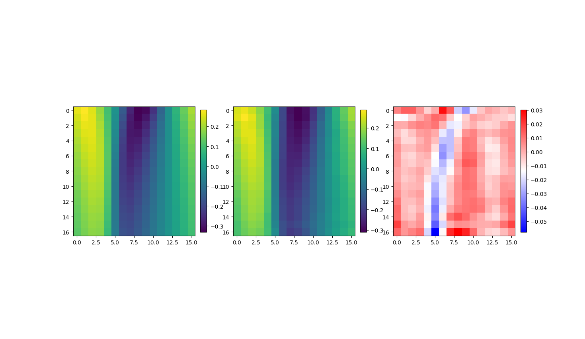
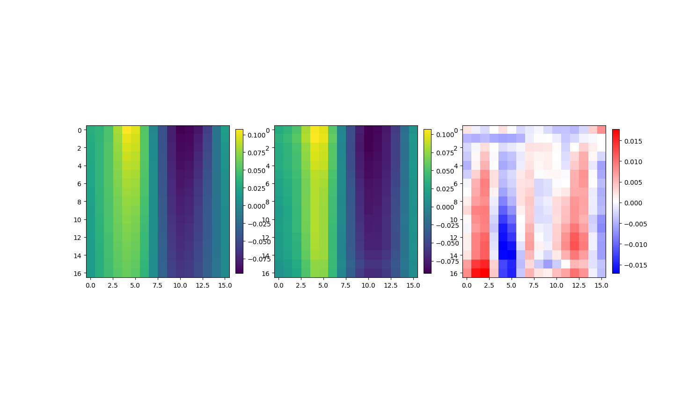
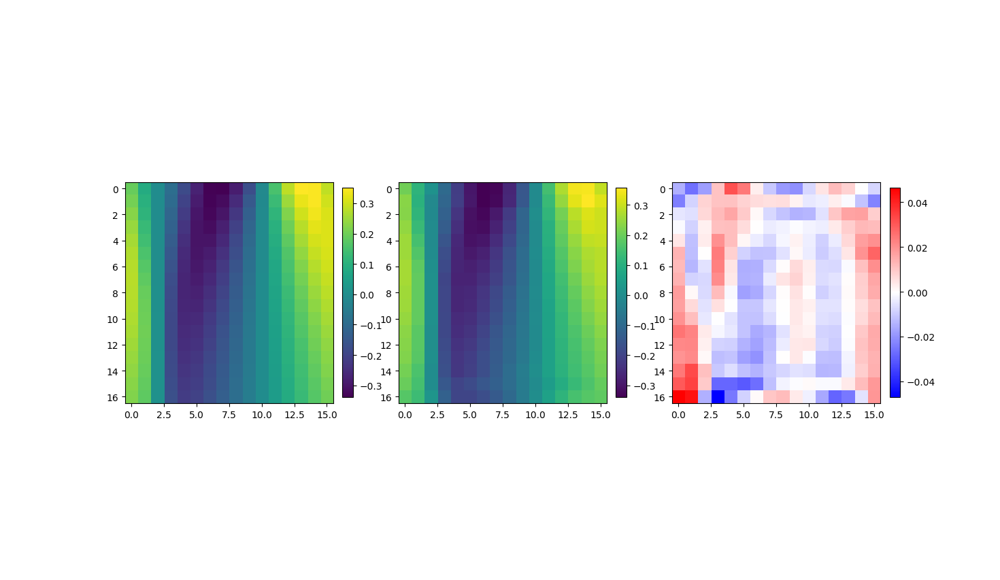
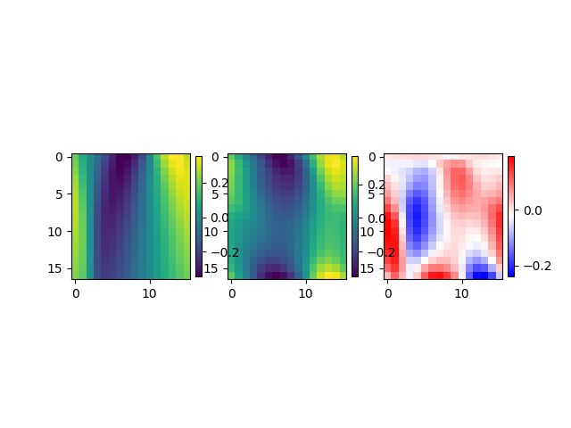

This repo provides an example implementation of a FNO/PINO for a burgers equation. Adding initial condition loss reduced the MSE by a factor of 5. The PDE loss calculated with finite differences on the other side considerably hinders the training probably due to coarse resolution of the grid (which coases large discretiyaion errors). A solution would be to upsample the inputs for PDE loss. This however wouold requre a custom trainer.

